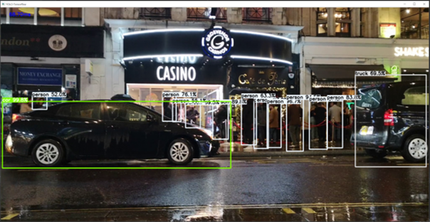

# Simple Video Object Detection using Opencv Dnn, Tensorflow, Pytorch
**한글**로 된 README를 보기 위해서는 해당 링크로 가면 됩니다 - [README-kr](/readme/README-kr.md)

This project is a simple opencv, tensorflow, pytorch implementation of **Faster RCNN**, **Mask RCNN**, **YOLO**. 
The purpose of this project is to implement a simple object detection program using various frameworks.
Object detection programs were tested on CPU environment as well as on GPU(NVIDIA GeForce GTX 1080).
However, since opencv does not support cuda operations for NVIDIA gpu, opencv DNN codes were tested only on CPU.
There **isn't a code for training**, only codes to detect objects with pre-trained models. THe program goes through following processes:

1. Reads video file or launches web camera
2. Detects objects with pre-trained models (Trained on **COCO**)
3. Draws bounding boxes and labels.

While implementing, I referred to amazing implementations of other repositories listed below: 

* Opencv Dnn, Pytorch FasterRCNN <br/>
https://github.com/spmallick/learnopencv
* Pytorch-Yolo <br/>
https://github.com/ayooshkathuria/pytorch-yolo-v3
* Tensorflow, Tensorflow-Yolo <br/>
https://github.com/tensorflow/models/tree/master/research/object_detection<br/> 
https://github.com/wizyoung/YOLOv3_TensorFlow<br/>


## Requirements

* Python 3.6
* torch 1.0<br>
```pip install torch==1.0```
* torchvision 0.3.0
* opencv-python 4.1.0
* imutils 0.5.2<br> 
```pip install torchvision opencv-python imutils```
* tensorflow 1.14.0
* tensorflow-gpu 1.1.0<br>
```pip install tensorflow tensorflow-gpu```


##How To Get Pre-trained Models
In the project pre-trained models were obtained from 3 sources. First, from tensorflow object detection api site.
Second, from yolo site. Third, pre-trained model that is automatically downloaded by pytorch framework. 
### 1. Tensorflow Object Detection API

1.1 Go to Tensorflow Object Detection API page
<br/>
https://github.com/tensorflow/models/blob/master/research/object_detection/g3doc/detection_model_zoo.md


1.2 Find table that looks like the image and download COCO pre-trained model.

### 2. Yolo
1.1 Go to Yolo page.<br/>
https://pjreddie.com/darknet/yolo/

1.2 Download pre-trained model, place files under `darknet` directory(The project was tested only on Yolov3)

### 3. Pytorch automatic pre-trained model
From `torchvision 0.3.0` pre-trained model for object detection is provided. The framework automatically downloads `pth` file.
```python
from torchvision import models

model = models.detection.fasterrcnn_resnet50_fpn(pretrained=True)
```

## How To Convert Pre-trained models to use in other frameworks.

### 1. Tensorflow Pre-trained model => Opencv Dnn
In order to use pre-trained model in **Opencv**, frozen inference graph file `.pb` must be converted to `.pbtxt` file.
The way to convert `.pb` file differs by object detection architecture <br/>
Example) if downloaded pre-trained model is faster rcnn
```Shell
$ python tf_text_graph_faster_rcnn.py --input /path/to/.pb --output /path/to/.pbtxt --config /path/to/pipeline.config
``` 

### 2. Yolo Pre-trained model => Tensorflow
In order to use yolo in tensorflow, the `.weights` file must be converted to `ckpt` file. 
First, make sure that `yolo_anchors.txt` file is under `darknet` directory.
Second, place downloaded `yolov3.weights` file and `yolov3.cfg` file under `darknet` directory<br/>
```Shell
python convert_weight.py
``` 
After the command, `ckpt` file and other necessary files for yolo object detection will be placed under `darknet` directory.

## Running Demos
<div style="display:inline-block;">


</div>
Assuming that video file is under `assets` directory and yolo `weights, ckpt, cfg` files under `darknet` directory.
Replace `/path/to/...` part with actual path to files.
#### FasterRCNN Opencv
```
python opencv_fasterrcnn.py --video assets/cars.mp4 --pbtxt /path/to/.pbtxt --frozen /path/to/frozen_inference_graph.pb --conf 0.5
```

#### MaskRCNN Opencv
```Shell
python opencv_maskrcnn.py --video assets/cars.mp4 --pbtxt /path/to/.pbtxt --frozen /path/to/frozen_inference_graph.pb --conf 0.5 --mask 0.3
```

#### Yolo Opencv
```Shell
python opencv_yolo.py --video assets/cars.mp4 --config darknet/yolov3.config --weight darknet/yolov3.weights --conf 0.5 --nms 0.4 --resol 416
```

#### FasterRCNN Pytorch
```Shell
python pytorch_pretrained.py --video assets/cars.mp4 --conf 0.5
```

#### Yolo Pytorch
```Shell
python pytorch_yolo.py --video assets/cars.mp4 --config darknet/yolov3.config --weight darknet/yolov3.weights --conf 0.5 --nms 0.4 --resolution 416
```

#### FasterRCNN Tensorflow
```Shell
python tensorflow_pretrained.py --video assets/cars.mp4 --frozen /path/to/frozen_inference_graph.pb --conf 0.5
```

#### Yolo Tensorflow
```Shell
python tensorflow_yolo.py --video assets/cars.mp4 --ckpt darknet/yolov3.ckpt --conf 0.5 --nms 0.4 --achor_path darknet/yolo_anchors.txt --resolution 416
```
<div style="display:inline-block;">


</div>

## Running Demos on Webcam
In order to run object detection on webcam, simply remove `--video` and add `--webcam True`. This is same to other programs as well.<br/>
Example)  fasterrcnn pytorch
```Shell
python pytorch_pretrained.py --webcam True --conf 0.5
```

Video by Videogrammer from Pexels cars

Video by Pixly Videos from Pexels
Video by Life of Pix from Pexels

Video by Adailton Batista from Pexels children
Video by George Morina from Pexels beauticars

Coverr carsss
clara blasco short car