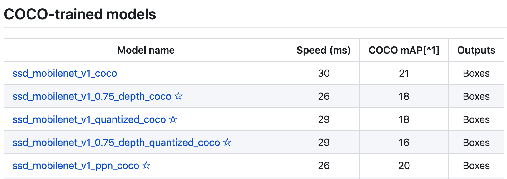

# Opencv Dnn, Tensorflow, Pytorch로 구현한 간단한 object detection 프로그램
해당 프로젝트는 opencv, tensorflow, pytorch로 **Faster RCNN**, **Mask RCNN**, **YOLO**를 사용해서 object들을 인식한다. 
목표는 다양한 프레임워크들과 라이브러리들을 이용해서 object detection을 해보는 것이다. 모든 코드들은 CPU와 GPU(NVIDIA GeForce GTX 1080)에서 테스트가 되었습니다.
다만, opencv가 NVIDIA GPU를 지원하지 않기 때문에, opencv DNN을 사용한 코드들은 CPU에서만 테스트 되었습니다.
해당 프로젝트에는 **트레이닝**을 하는 코드는 없습니다. 오로지 이미 학습된 모델들을 사용해서 object detection을 합니다. 프로그램들은 
다음과 같이 작동을 합니다:

1. 비디오 파일을 읽던지 내장 카메라를 실행시킨다
2. **COCO**에 pre-trained된 model을 가지고 object들을 감지합니다
3. 감지된 object에 사각형 박스와 라벨을 그립니다

구현을 하면서, 밑에 있는 레퍼지토리를 참고했습니다: 

* Opencv Dnn, Pytorch FasterRCNN <br/>
https://github.com/spmallick/learnopencv
* Pytorch-Yolo <br/>
https://github.com/ayooshkathuria/pytorch-yolo-v3
* Tensorflow, Tensorflow-Yolo <br/>
https://github.com/tensorflow/models/tree/master/research/object_detection<br/> 
https://github.com/wizyoung/YOLOv3_TensorFlow<br/>


## 요구사항

* Python 3.6
* torch 1.0<br>
```pip install torch==1.0```
* torchvision 0.3.0
* opencv-python 4.1.0
* imutils 0.5.2<br> 
```pip install torchvision opencv-python imutils```
* tensorflow 1.14.0
* tensorflow-gpu 1.1.0<br>
```pip install tensorflow tensorflow-gpu```


##Pre-trained Models 다운 받는 방법
프로젝트에서는 3군데에서 다운 받은 pre-trained model들을 사용했습니다. 
### 1. Tensorflow Object Detection API

1.1 Tensorflow Object Detection API page 로 접속을 합니다
<br/>
https://github.com/tensorflow/models/blob/master/research/object_detection/g3doc/detection_model_zoo.md



1.2 이미지에 있는 표와 같은 표를 찾고 COCO로 학습된 pre-trained model을 다운 받습니다. 

### 2. Yolo
1.1 Yolo page에 접속을 합니다.<br/>
https://pjreddie.com/darknet/yolo/

1.2 Pre-trained model을 다운 받고, `darknet` 디렉토리 안으로 파일들을 옮깁니다.(해당 프로젝트는 Yolov3만 테스트를 했습니다)

### 3. Pytorch에서 제공하는 pre-trained model
`torchvision 0.3.0`부터 pre-trained된 model을 손쉽게 사용할 수 있습니다. Pytorch에서 알아서 `pth`형식의 pre-trained된 model을 다운 받고 바로 사용할 수 있게 해줍니다.
```python
from torchvision import models

model = models.detection.fasterrcnn_resnet50_fpn(pretrained=True)
```

## 다른 framework에서 사용할 수 있도록 pre-trained된 model 변환시키는 방법
Pre-trained된 model들은 각자 고유의 형식을 가지고 있어서 바로 다른 framework에서 같은 파일을 사용하는 것이 안되는 경우가 많습니다. 그래서 다른 framework에서도 사용할 수 있도록
model의 형식을 변환하는 법을 알려드립니다.

### 1. Tensorflow Pre-trained model => Opencv Dnn
Tensorflow에서 작동하는 frozen inference graph `.pb` 형식의 model을 **Opencv**에서 사용하기 위해서는 해당 파일을 `.pbtxt` 형식으로 변환을 해야합니다. 
참고로, object detection 구조마다 `.pb`파일을 변환하는 법은 다릅니다.<br/>
예) 다운 받은 pre-trained model이 faster rcnn일 때, 
```Shell
$ python tf_text_graph_faster_rcnn.py --input /path/to/.pb --output /path/to/.pbtxt --config /path/to/pipeline.config
``` 

### 2. Yolo Pre-trained model => Tensorflow
Darknet에서 제공해주는 yolo의 `.weights` 형식의 모델을 tensorflow에서 사용하기 위해서는 `ckpt` 형식으로 변환을 해야합니다. 
첫 째로, `yolo_anchors.txt` 파일이 `darknet` 디렉토리 안에 있는지 확인을 합니다. 
둘 째로, 다운 받은 `yolov3.weights` 와 `yolov3.cfg` 파일들을 `darknet` 디렉토리 안으로 옮깁니다.<br/>
```Shell
python convert_weight.py
``` 
해당 프로그램을 실행시키면, `ckpt` 형식의 파일이 만들어지고 이 파일도 `darknet` 디렉토리 안에 있는 것을 확인합니다.

## Demo 실행
비디오 영상 파일이 `assets` 디렉토리 안, yolo `weights, ckpt, cfg` 파일들이 `darknet` 디렉토리 안에 있을 때의 demo를 실행시키는 방법입니다. 
추가로, 밑에 `/path/to/...` 이러한 부분이 나오면 해당 파일이 있는 경로로 대체를 해야합니다.
#### FasterRCNN Opencv
```
python opencv_fasterrcnn.py --video assets/cars.mp4 --pbtxt /path/to/.pbtxt --frozen /path/to/frozen_inference_graph.pb --conf 0.5
```

#### MaskRCNN Opencv
```Shell
python opencv_maskrcnn.py --video assets/cars.mp4 --pbtxt /path/to/.pbtxt --frozen /path/to/frozen_inference_graph.pb --conf 0.5 --mask 0.3
```

#### Yolo Opencv
```Shell
python opencv_yolo.py --video assets/cars.mp4 --config darknet/yolov3.config --weight darknet/yolov3.weights --conf 0.5 --nms 0.4 --resol 416
```

#### FasterRCNN Pytorch
```Shell
python pytorch_pretrained.py --video assets/cars.mp4 --conf 0.5
```

#### Yolo Pytorch
```Shell
python pytorch_yolo.py --video assets/cars.mp4 --config darknet/yolov3.config --weight darknet/yolov3.weights --conf 0.5 --nms 0.4 --resolution 416
```

#### FasterRCNN Tensorflow
```Shell
python tensorflow_pretrained.py --video assets/cars.mp4 --frozen /path/to/frozen_inference_graph.pb --conf 0.5
```

#### Yolo Tensorflow
```Shell
python tensorflow_yolo.py --video assets/cars.mp4 --ckpt darknet/yolov3.ckpt --conf 0.5 --nms 0.4 --achor_path darknet/yolo_anchors.txt --resolution 416
```

## Running Demo on Webcam
내장되있는 카메라로 object detection 프로그램을 실행시키려면 `--video`를 argument에서 제거해주시고 `--webcam True`를 넣으면 됩니다. 이 사항은 모든 프로그램에서 동일하게 적용됩니다.<br/>
예)  fasterrcnn pytorch
```Shell
python pytorch_pretrained.py --webcam True --conf 0.5
```
